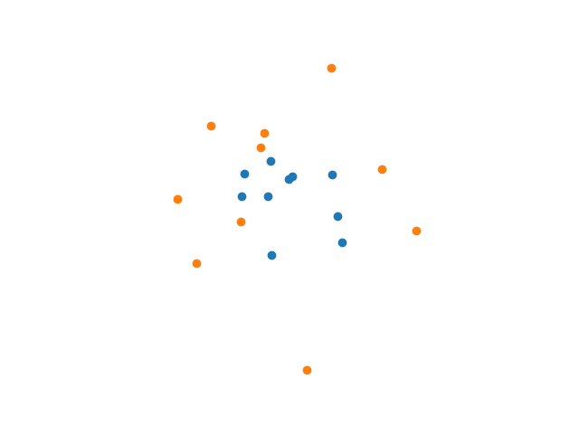
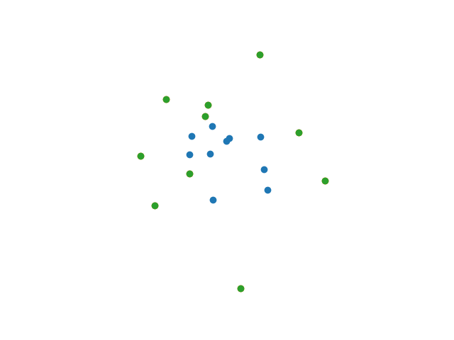

## Sorting the Correspondence Space

This is an implementation of the Sorting the Correspondence Space Algorithm in python.

As described in "Assalih, H., 2013. 3D reconstruction and motion estimation using forward looking sonar (Doctoral dissertation, Heriot-Watt University)."

## Requirements

- Core requirements
  - Python 3.x
  - numpy

- for testing
  - pytest

## Example



Consider these 2 sets of points. The goal is to compute the transformation matrix T that satisfies: B = T.A

A being the coordinates matrix of the blue set of points (starting set) and B the one of the orange set (destination set).
(Note that the points aren't in order in the following matrices i.e. A[n] doesn't necessarily map to B[n])

```python
import numpy as np
from scs import SCS

# the point sets
A = np.array([[ 0.39451787, -0.10710954],
              [-0.44032071,  0.27115992],
              [ 0.34988326,  0.26474344],
              [-0.19661604, -0.45939779],
              [-0.22855593,  0.07096955],
              [-0.4638265 ,  0.06492835],
              [-0.00553488,  0.24695599],
              [-0.04137169,  0.2184062 ],
              [ 0.43547498, -0.34479352],
              [-0.20069047,  0.38554812]])

B = np.array([[-0.25654269,  0.63330816],
              [ 0.79043454,  0.31349807],
              [-1.03381777,  0.04401307],
              [-0.86829941, -0.52705096],
              [ 0.11884882, -1.48847452],
              [-0.46684004, -0.15844959],
              [-0.29006407,  0.5053784 ],
              [ 1.09905831, -0.24258737],
              [-0.73315421,  0.7006477 ],
              [ 0.34127214,  1.21264853]])

# computing the transformation matrix using SCS
m = SCS(src=A, dst=B)
m.fit()
```

Now lets check the solution


```python
# m.src.T is just the matrix A with a column of ones
# at the bottom, and then simply transposed.
C = np.matmul(m.T, m.src.T)
```
Plotting the resulting set of points (green), we see it perfectly lands on B.



We can access both the transformation matrix T and the parameters of the transformation using:
```python
>>> m.T
[[ 1.73205081 -1.00000001  0.        ]
 [ 1.50000001  2.5980762   0.        ]
 [ 0.          0.          1.        ]]
>>> m.params
{'Tx': 0.0, 'Ty': 0.0, 'Sx': 2.0000000044187316, 'Sy': 2.9999999968893456, 'theta': 0.5235987776857001}
```

## Notes

- This implementation lacks the outliers filtering technique described in the above source. A template for the filtering is now available, the tests are written explicit to match the paper and it only lacks the logic, any contribution on this issue will be very much appreciated.

- As mentioned by the paper, this algorithm performs poorly with regards to translations.

## Author

- Mallek Mounir